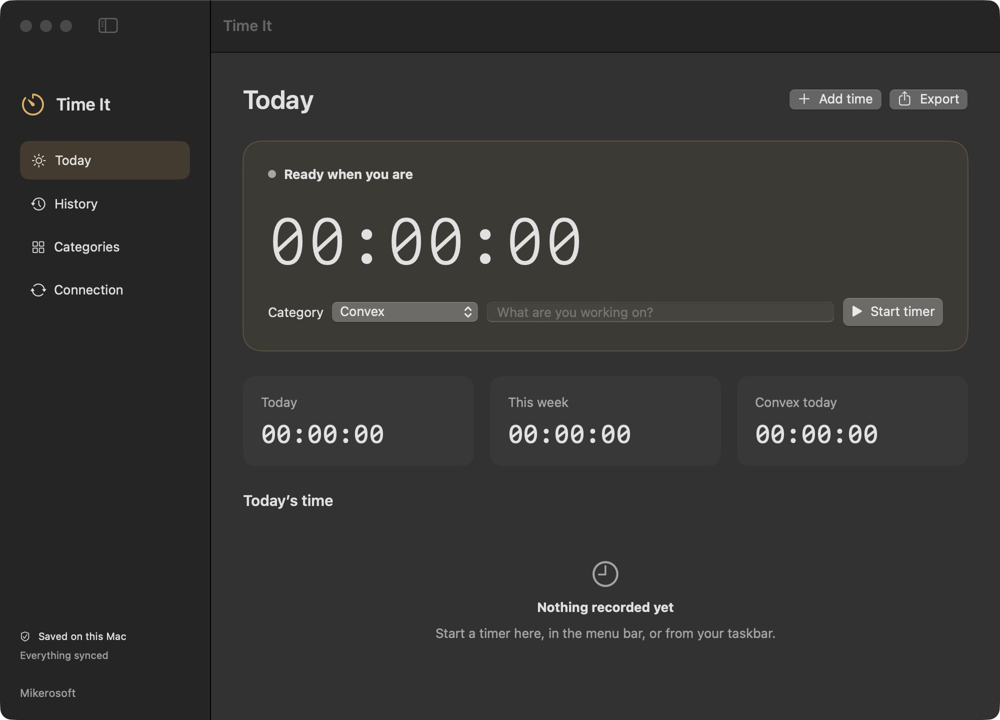

# Time It

My little time tracker for the Mac, part of [Mikerosoft](https://mikerosoft.app).

I wanted to replace Clockify with something I could make my own, and have a button in the menu bar to start and stop work. It defaults to Convex, but you can add other categories too.



## Using it

Click the timer icon in the menu bar and choose Start Convex Timer. Choose Stop Timer when you’re finished. The same menu lets you open the app or sync now.

The app window lets you choose another category, add a note, edit your history, add time you forgot to record, and export a CSV. Convex stays the default for the next quick start.

Open Reports to see where your time went. There’s a stacked time chart, a category breakdown, average hours by weekday, and a daily activity grid. Choose a week, month, year, all your history, or your own dates, and filter by category. Overnight sessions are split at local midnight. Reports work offline and include the running timer, updating each minute.

The daily average cards use the previous 30 complete local days, regardless of the chart’s date range. One averages days with any recorded time; the other averages only days with at least six hours recorded. Both follow the category filter, show the number of days counted, and leave today out so an unfinished day doesn't pull the average down. The six-hour threshold uses the day's combined sessions. If no days qualify, the card says No data.

Overlapping sessions keep their original times and count towards the total. Reports show how much overlap there is so you can review it in History if needed.

Time is saved on your Mac before anything goes over the network. You can start and stop offline, quit the app with a timer running, and pick up where you left off. Sleep counts as elapsed time, so stop the timer when you're finished. When your connection comes back, pending changes upload automatically. History downloads on launch, reconnection, or when you press Sync now; an idle app does not keep downloading the whole history.

## Get it

Paste this into your AI coding agent:

> Clone https://github.com/mikecann/time-it and make it my own. It's one of Mike
> Cann's personal tools, so read the README first, change anything specific to his
> setup to suit mine, then help me get it running.

## Install

You need macOS 14 or newer and Xcode or the Command Line Tools.

```sh
git clone https://github.com/mikecann/time-it.git
cd time-it
bash restart.sh
```

That builds and installs `~/Applications/Time It.app`. It keeps running in the menu bar when you close the window. You can enable Start at login in Connection settings.

Your local data lives in `~/Library/Application Support/com.mikerosoft.time-it/state.json`. Back that file up if you want a separate copy. If it can't be read, the app keeps it and shows an error rather than replacing your history.

## Convex sync

The native app works without a backend connection. My development and production deployments run in Sydney (`aws-ap-southeast-2`), and the installed app uses production. Mike approved the two-table schema on 5 October 2026. See [the data model](docs/data-model-proposal.md) for the fields and sync rules.

To set up your own backend in Australia:

```sh
npm ci
npx convex deployment create your-team:your-project:dev/mac --type dev --region aws-ap-southeast-2 --default --select
npx convex dev --once
npx convex deployment create your-team:your-project:live --type prod --region aws-ap-southeast-2 --default
npx convex deploy
```

Set a random `TIME_IT_SYNC_KEY` of at least 32 characters in your Convex deployment's environment. The native app connects to the corresponding `https://your-deployment.ap-southeast-2.convex.site` URL, using the same key in Connection settings. The app stores the key in macOS Keychain. Never commit it.

For unattended local setup, `scripts/connect-sync.py` reads the key from stdin and stages it in a file readable only by your account. Restart the installed app to move it into Keychain and remove that file.

Only the authenticated HTTP endpoint can reach the internal database functions. Stable IDs make upload retries safe, and revision acknowledgements keep an edit made during sync from getting lost. Archived categories keep their old history. Deleted entries keep a tombstone so an old offline copy doesn't bring them back.

This first version is a personal, single-owner app. The key gives access to the whole personal workspace. If you use two Macs offline, they can each run a timer; they don't coordinate while disconnected. Conflicting edits choose the higher revision, then device ID to break a tie.

## Importing Clockify

Create an API key in Clockify under Preferences, Advanced, Manage API keys. Save it in a private local file rather than putting it in a command or committing it. The exporter uses [Clockify’s API](https://docs.clockify.me/) to read your own sessions from every accessible workspace, including history on archived projects. It doesn’t change Clockify.

```sh
python3 scripts/export-clockify.py --key-file work/clockify-api-key.txt --output work/clockify-export
```

In Time It, open History, click Import Clockify, and choose `work/clockify-export/time-it.json`. The import saves a backup first, keeps your running Time It timer, and queues the imported history for normal Convex sync. Stable Clockify IDs mean you can import the archive again without duplicates, and edited or deleted sessions stay as you saved them.

Clients become categories where available, otherwise the project name is used. Convex projects use the existing Convex category. Descriptions, project names, tasks and tags are retained in the note, and the full source records are kept in the private `clockify-source.json` archive. A running Clockify entry is skipped until it has a finish time. `summary.json` records the export count, date range and duration for verification.

## Development

```sh
swift test
npm test
npm run typecheck
python3 scripts/test-export-clockify.py
bash restart.sh
```

The Swift tests also cover report totals, daylight saving changes, overlaps, import backups, duplicate imports, edited and deleted imported sessions, and preserving a running timer. Exporter tests check source labels, exact times and pagination. The backend tests cover request validation, authentication, and conflict order.

MIT licensed.
